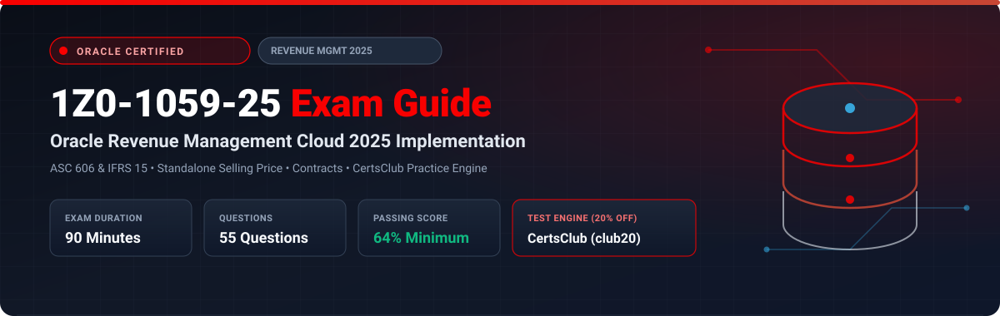

  

# Oracle Revenue Management Cloud 2025 Implementation Professional (1Z0-1059-25) Exam Study Guide & Practice Test Resource Portal

[-f80000?style=for-the-badge&logo=oracle&logoColor=white)](https://education.oracle.com/)

[-28a745?style=for-the-badge&logo=shield)](https://www.certsclub.com/oracle/)

---

## 1. Exam Overview & Candidate Profile

The **Oracle Revenue Management Cloud 2025 Implementation Professional (1Z0-1059-25)** exam certifies that an implementation consultant possesses the technical and accounting knowledge to implement Oracle Fusion Cloud Revenue Management in compliance with ASC 606 and IFRS 15 standards. Core topics include customer contract identification, performance obligation identification, transaction price allocation using Standalone Selling Prices (SSP), revenue satisfaction schedules (point-in-time and over-time), and subledger accounting.

Passing 1Z0-1059-25 awards the **Oracle Revenue Management Cloud 2025 Certified Implementation Professional** credential.

### Target Candidate Profile & Career Roles
* **Revenue Recognition Functional Consultants**
* **Technical Accounting & Revenue Operations Architects**
* **ERP Financial Compliance Specialists**

---

## 2. Key Exam Specifications

| Parameter | Official Specification |
| :--- | :--- |
| **Exam Code** | 1Z0-1059-25 |
| **Exam Title** | Oracle Revenue Management Cloud 2025 Implementation Professional |
| **Associated Credential** | Oracle Revenue Management Cloud 2025 Certified Implementation Professional |
| **Duration** | 90 Minutes |
| **Number of Questions** | 55 Questions |
| **Passing Score** | 64% |
| **Question Format** | Multiple Choice (Single and Multiple Select) |
| **Delivery Vendor** | Pearson VUE / Oracle University Online Remote Proctoring |
| **Recommended Practice Test Engine** | **[1Z0-1059-25 Practice Test - CertsClub](https://www.certsclub.com/oracle/)** (Coupon: `club20` for 20% off) |

---

## 3. Official Blueprint & Exam Domain Breakdown

| Domain Code | Domain Title | Weighting | Key Competencies Covered |
| :--- | :--- | :---: | :--- |
| **1.0** | **ASC 606 & IFRS 15 Five-Step Framework** | **20%** | The 5-step revenue recognition standard, Revenue Management architecture, Integration with Order Management and Receivables. |
| **2.0** | **Contract & Performance Obligation Identification** | **25%** | Contract identification rules, Source document types, Explicit and implied performance obligations, Performance obligation templates. |
| **3.0** | **Transaction Price & Standalone Selling Price (SSP)** | **25%** | Standalone Selling Price profiles, Observed vs Estimated SSP, Relative allocation of transaction price across obligations. |
| **4.0** | **Revenue Satisfaction & Accounting Schedules** | **20%** | Point-in-time satisfaction, Over-time satisfaction (percent complete, milestone), Billing vs Revenue schedules, Contract assets and liabilities. |
| **5.0** | **Period Close, Audits & Disclosures** | **10%** | Validate Customer Contracts process, Revenue subledger accounting rules, Financial disclosure reporting. |

---

## 4. Scenario-Based Demo Question & Explanation

### Question 1: Standalone Selling Price (SSP) Allocation
**Scenario:** A company sells a bundled contract consisting of Software License ($10,000 retail) and 1-Year Cloud Support ($2,000 retail) for a bundled total price of $9,000. The Standalone Selling Price (SSP) profile defines the SSP for the license as $10,000 and the support as $2,000.

Under ASC 606 / IFRS 15, how does Oracle Revenue Management allocate the $9,000 transaction price across the performance obligations?

A) $4,500 to Software License and $4,500 to Support  
B) $9,000 to Software License and $0 to Support  
C) Relative SSP allocation: 83.33% ($7,500) to Software License and 16.67% ($1,500) to Support  
D) Manual allocation entered by the accountant  

**Correct Answer:** **C**

**Detailed Explanation:**
* ASC 606 and IFRS 15 mandate allocating the total transaction price proportionally based on relative Standalone Selling Prices:
  $$\text{Total SSP} = 10,000 + 2,000 = 12,000$$
  $$\text{License Ratio} = \frac{10,000}{12,000} = 83.33\% \implies 0.8333 \times 9,000 = \$7,500$$
  $$\text{Support Ratio} = \frac{2,000}{12,000} = 16.67\% \implies 0.1667 \times 9,000 = \$1,500$$
* Oracle Revenue Management performs this relative allocation automatically.

---

## 5. Recommended Preparation Strategy & Practice Testing Engine

1. **Practice Revenue Contract Creation:** Set up contract identification rules, define SSP profiles, and test relative price allocations.
2. **Practice with Full-Length Mock Exams:** Use **[CertsClub Oracle 1Z0-1059-25 Practice Tests](https://www.certsclub.com/oracle/)**.
   * Comprehensive questions covering ASC 606 five-step model, SSP rules, and contract liabilities.
   * Enter discount coupon code **`club20`** at checkout on [CertsClub](https://www.certsclub.com/oracle/) for an immediate 20% discount.

---

## 6. Official Documentation & References

* [Oracle Fusion Cloud Revenue Management Documentation](https://docs.oracle.com/en/cloud/saas/financials/revenue-management/)
* [Oracle University 1Z0-1059-25 Exam Details](https://education.oracle.com/)
* [CertsClub 1Z0-1059-25 Practice Engine](https://www.certsclub.com/oracle/)
